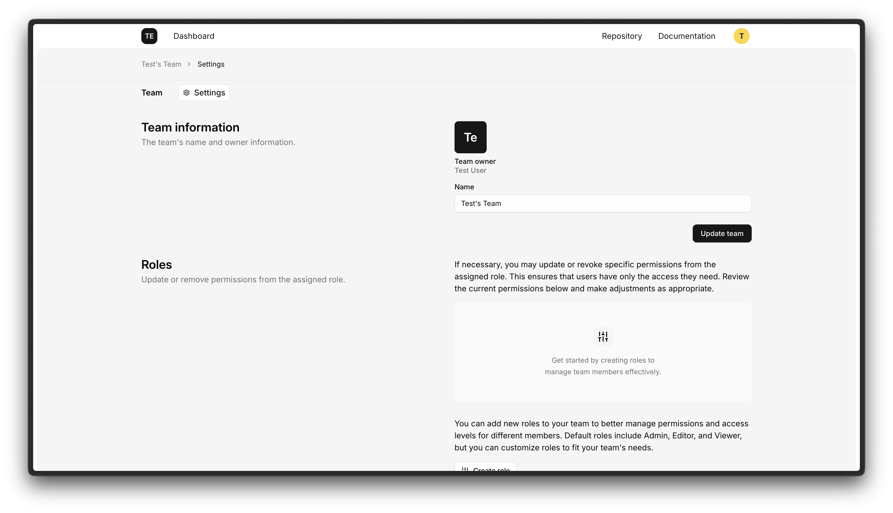

<p align="center"><a href="https://liraui.com/docs/team/installation" target="_blank"></a></p>

# Team package

Opinionated authentication package for Laravel, and React applications. This package provides server-side actions, models, and convenient frontend screens and components to manage teams, memberships, roles, and invitations.

> ⚠️ Beta: This project is in BETA — APIs, file layout, and packages may change. Use for prototyping and early development. Report bugs or breaking changes in issues, please.

## What this package provides

- **Team management:** Create and delete teams, update team names and settings.
- **Memberships:** Invite members, accept/decline invitations, remove members, and switch the current team.
- **Roles & permissions:** Create team roles, assign roles to members, and update role definitions.
- **Invitations:** Email invitations with configurable templates and expiration handling.
- **Frontend helpers:** React/Inertia-friendly screens and components (team list, settings, invitations) and typed route/action helpers.
- **Laravel-first:** Actions, requests, resources, mailables, and policies wired for a Laravel application.

## Quick start

Install the package with Composer:

```bash
composer require liraui/team
```

For full installation instructions and documentation, visit the [Installation guide](https://liraui.com/docs/team/installation).

## Testing

```bash
composer test
# Tests:    28 passed (73 assertions)
# Duration: 2.49s

composer test-coverage
# Total: 79.5%
```

## Contributing

Bug reports and contributions are welcome — please open an issue or a pull request. Maintain a short description of breaking changes.

## License

The team package is open-sourced and licensed under the MIT license.
